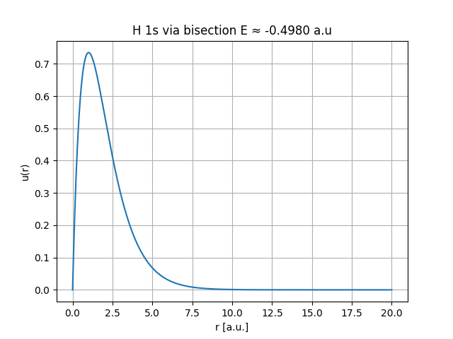
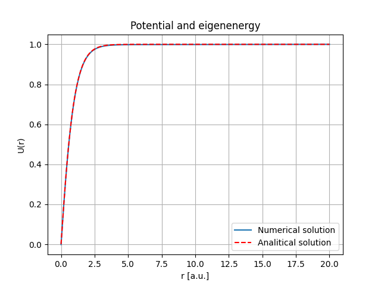

# DFT Helium Solver

A radial density functional theory (DFT) solver for the helium atom, written in Python.  
The code implements a self-consistent field (SCF) cycle, solving the radial Schrödinger equation 
with nuclear, Hartree, exchange, and correlation potentials.  

Although currently set up for helium (Z = 2), the solver can be adapted to other atoms by changing `Z`.  


The code is composed by the following main parts:
- Radial grid solver for atomic orbitals.
- Nuclear potential `Vn = -Z/r`.
- Hartree potential computed with a Verlet-like algorithm.
- Exchange and correlation potentials in the Ceperley-Alder Local Density parametrization (CA LDA).
- Eigenvalue solver using the bisection method.
- Normalization of radial wavefunctions and density construction.
- Self-consistent field (SCF) loop with configurable convergence.
- Logging system: all iterations saved to file, final result printed to console.


The total energy is evaluated according to a simplified Kohn–Sham DFT formula:

$$
E_\text{tot} = 2 E_\text{eff} - E_H + \tfrac{1}{2}\big(-E_x + E_c\big)
$$

where:

- **$2 E_\text{eff}$** → sum of orbital eigenvalues (two electrons in the 1s orbital),  
- **$-E_H$** → correction to remove Hartree double counting,  
- **$\tfrac{1}{2}(-E_x + E_c)$** → exchange–correlation correction (as defined in this implementation).  

For more complex atoms, the general Kohn–Sham energy expression should be used:

$$
E[\rho] = \sum_i f_i \, \varepsilon_i - E_H[\rho] + E_{xc}[\rho] + E_\text{ext}[\rho],
$$

with $f_i$ the orbital occupations.


 **Benchmarks and Tests**

To verify the physical correctness of the implementation, two benchmark tests were performed 
with the hydrogen atom (Z = 1):

**Bisection method with nuclear potential only**
- Considered only the nuclear potential $V(r) = -1/r$ and solved for the 1s orbital.  
- Obtained eigenvalue: **-0.49 a.u.**  
- Reference value: **-0.50 a.u**  
- The numerical solution matches the analytical result within the expected accuracy.  

  
*Comparison between the numerical solution of the hydrogen 1s orbital using the bisection method with only the nuclear potential and the analytical reference value. The computed eigenvalue (-0.49 a.u.) is in very good agreement with the exact result (-0.50 a.u), confirming the correctness of the eigenvalue solver.*

**Hartree potential test via Poisson’s equation**
- Computed the Hartree potential numerically for the hydrogen atom and compared it against the   solution obtained directly from solving Poisson’s equation. 
 For hydrogen the ground state density (at $E = -0.5 \,\text{a.u.}$) is:

$$
\rho(r) = 4 e^{-2r}
$$

Solving

$$
U''(r) = -\frac{u^2(r)}{r}
$$

with boundary conditions $U(0) = 0$ and $U(r_{\max}) = 1$, one obtains:

$$
U(r) = - (r+1)e^{-2r} + 1
$$
 
- The two curves overlap perfectly, confirming the correctness of the Hartree solver.  

  
*Verification of the Hartree potential solver: numerical solution obtained from the radial algorithm is compared against the analytical solution of Poisson’s equation for the hydrogen atom. The two curves overlap almost perfectly, demonstrating the accuracy of the Hartree implementation.*

**Results**  
With a dense radial grid of 30,000 points (default setting), the computed total energy for Helium atom is -2.9015 a.u. This result is in good agreement with the benchmark values available for the helium atom (Z = 2) listed in the following table:

| Method                         | Total Energy (Hartree) | Notes |
|--------------------------------|-------------------------|-------|
| Exact (high-precision, benchmark) | -2.9037              | Variational/experimental reference |
| Hartree–Fock (HF)               | -2.8617              | Missing electron correlation |
| DFT-LDA (typical)               | -2.83 … -2.90        | Depends on parametrization of exchange–correlation |

## Installation

Clone the repository and install the dependencies with:

```bash
git clone https://github.com/username/helium-dft.git
cd helium-dft
pip install -r requirements.txt
```bash


**References**  
Griffiths, D. J. Introduction to Quantum Mechanics, 3ª edizione, Darrell F. Schroeter, Cambridge University Press, 2018. ISBN 978-1-107-18963-8.